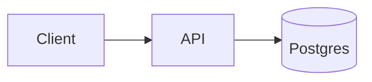

# project-name

One paragraph: what this is and why it exists. A stranger should understand the project in two sentences.

Badges: CI status. Optionally license and release. Nothing decorative.


## Features

- 4–8 bullets, each a real capability, not marketing.

## Tech stack

One line per layer: language, framework, storage, infra. Only what is actually used.

## Architecture



Two or three sentences on the key decisions: why this shape, what the trade-off was.

## Getting started

```bash
git clone https://github.com/aminyx/project-name
cd project-name
cp .env.example .env
# exact commands that actually work, verified before publishing
```

## Environment variables

| Variable | Required | Description |
|---|---|---|

## Testing

```bash
# exact command
```

## Docker

```bash
docker compose up
```

## Deployment

Where the demo runs, or an honest explanation of how to deploy it and why there is no hosted demo.

## API

Endpoint table or link to OpenAPI spec — only if the project exposes an API.

## Future improvements

3–5 realistic items. No fantasy roadmap.

## License

MIT
